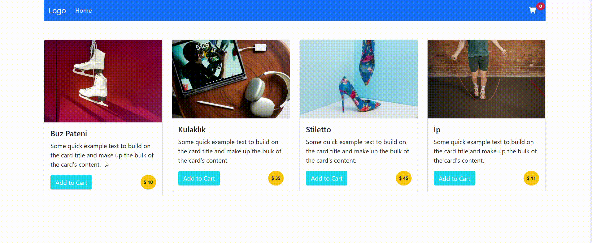

# Alışveriş Kartı Uygulaması

Bu proje, basit bir alışveriş kartı uygulamasını göstermektedir. Kullanıcılar ürünleri sepete ekleyebilir ve sepetin içeriğini görüntüleyebilirler. Uygulama, HTML, CSS ve JavaScript kullanılarak oluşturulmuştur.

## Proje Özeti

Bu uygulama, ürünleri alışveriş sepetine eklemek ve sepetin içeriğini görüntülemek için basit bir kullanıcı arayüzü sağlar. Ürünler bir liste halinde sunulur ve her ürünün yanında "Sepete Ekle" butonu bulunur. Kullanıcılar bu butona tıkladığında ürün sepete eklenir ve sepetin içeriği güncellenir.

## Teknolojiler

- **HTML**: Sayfanın yapısını oluşturur.

- **CSS**: Stil ve düzenleme işlemlerini yapar.

- **JavaScript**: Dinamik işlevsellik sağlar.

## Kullanım

1. Ürünler listesine gidin.

2. Sepete eklemek istediğiniz ürüne tıklayın.

3. Alışveriş sepetine giderek eklenen ürünleri görüntüleyebilirsiniz.

## Özellikler

- Ürünleri sepete ekleme.

- Sepetin içeriğini görüntüleme.

- Sepet görünümünü açıp kapama.

# Gif
